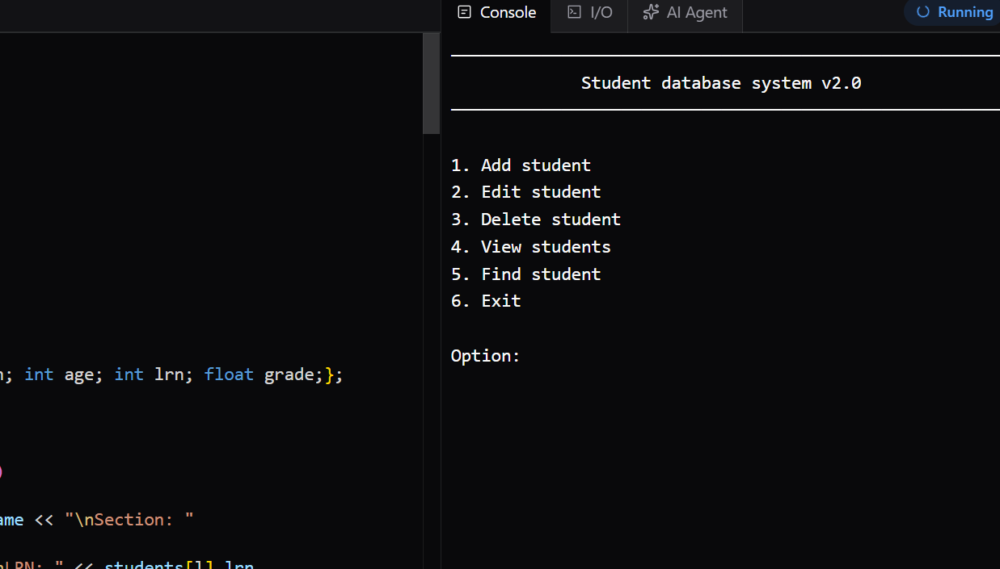
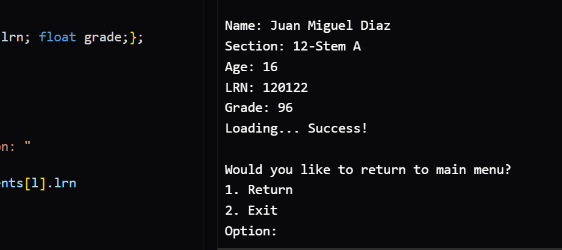
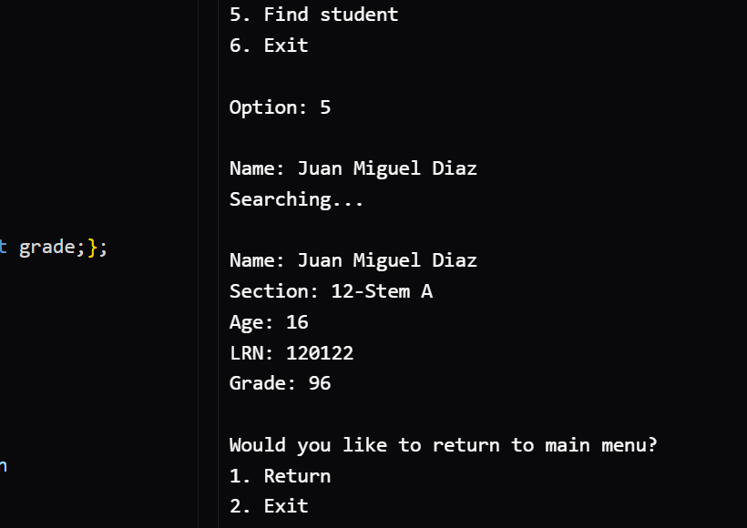
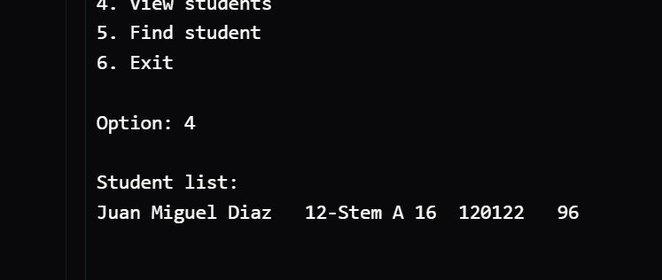

# Student-database-system
A C++ program that allows users to:

Add students, Search students, Edit students, Delete students, Save data to files

## Concepts Used
Structs, Vectors, File Handling, Functions

## Author
Juan Miguel Diaz

## Screenshots

